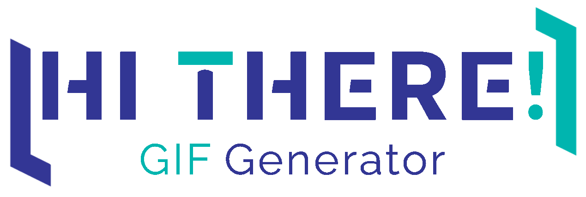

# InterSystems-HiThere-GIFGenerator

Generates a [InterSystems](https://www.intersystems.com/) HiThere Banner for your profiles.


---

-   [Requirements](#requirements)
-   [Usage](#usage)
-   [Configuration](#configuration)
-   [Custom Mode](#custom-mode)
-   [Bugs](#bugs)
-   [Release Notes](#release-notes)

---

## Requirements

-   [Python](https://www.python.org/) 3.7 or higher
-   [Pillow](https://pypi.org/project/Pillow/) 9.2.0 or higher
-   Download the _[DINAlternate-Bold.ttf](https://www.cufonfonts.com/font/din-alternate)_ and add it to the directory

---

## Usage

1.  Download the [latest release](https://github.com/phil1436/InterSystemsHiThereGifGenerator/releases/latest) and extract it to a folder of your choice.
2.  Open a terminal and navigate to the folder.
3.  Run the following command:

```bash
python3 Main.py
```

---

## Configuration

### Help

To get a list of all available properties, run the following command:

```bash
python3 Main.py -help
```

### Duration

The duration of the GIF can be configured with the `duration` property, followed by the duration, where a lower value means a faster animation. Default is 80.

_Run with a duration of 100:_

```bash
python3 Main.py -duration 100
```

> **Note:** The duration is not the same as the duration of the GIF. The duration is the time between each frame, while the GIF duration is the time between the first and the last frame.

### Hashtag

Add the hashtag _**#ItIsNotJustAJob**_ to the end with the `hashtag` property.

```bash
python3 Main.py -hashtag
```

>

### Hold

How long your name will be displayed can be configured with the `hold` property, followed by the number of frames. Default is 15.

_Will hold the name for 20 frames:_

```bash
python3 Main.py -hold 20
```

## Font

Change the font with the `font` property, followed by the path to the font. Default is `DINAlternate-Bold.ttf`.

```bash
python3 Main.py -font path/to/font.ttf
```

### Output

Change the output folder with the `output` property, followed by the path to the folder. Default is `out`.

```bash
python3 Main.py -output path/to/folder
```

### Whitespaces

Change the whitespaces with the `whitespaces` property, followed by `on` or `off`. Default is `on`.

```bash
python3 Main.py -whitespaces off
```

### Run in custom mode

You can run the application in custom mode, where you can specify. This is done with the `custom` property, the program will then ask you for the text you want to display.

```bash
python3 Main.py -custom
```

---

## Custom Mode

To customize the text, you want to display, you can run the application in custom mode.

```bash
InterSystemsHiThereGenerator> python3 Main.py -custom -whitespaces on

      *******************************************
      **** InterSystems-HiThere-GIFGenerator ****
      *******************************************

***Custom Mode***
Part 1
Enter first text (empty to stop): Part
Enter second text (can be empty): One
Part 2
Enter first text (empty to stop): Part
Enter second text (can be empty): Two
Part 3
Enter first text (empty to stop): Part
Enter second text (can be empty): Three
Part 4
Enter first text (empty to stop):
GIF Generated!
You can find it here: out/PartOne.gif

by phil1436
```

This will generate the following GIF:


> Tip: For full customization, you can also use the _[HiThereGIFGenerator.py](HiThereGIFGenerator.py)_ file directly. This file contains the `HTGIFGenerator` class, which can be used to generate the GIF. You can find an example in the _[Main.py](Main.py)_ file.

---

## Bugs

-   _no known bugs_

---

## [Release Notes](https://github.com/phil1436/InterSystemsHiThereGifGenerator/blob/master/CHANGELOG.md)

### [v0.0.2](https://github.com/phil1436/InterSystemsHiThereGifGenerator/tree/0.0.2)

### [v0.0.1](https://github.com/phil1436/InterSystemsHiThereGifGenerator/tree/0.0.1)

---

by Philipp B.

_This application is **not** supported by InterSystems Corporation._
